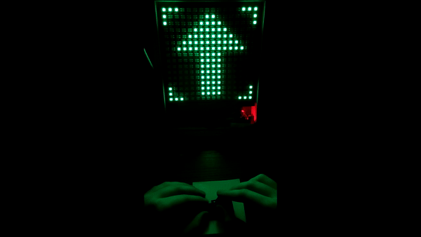

Hello everyone!
The project was created to have fun while I wait for the computer to start up. I used Arduino Nano and WS2812b 16x16 led panel. In addiction I had to make it more visual friendly so I bought a few thinks like a frame, wood board etc. 
Here we have gifs: 

*GAMEPLAY DARK*

--------------------------------------------------------------------------------------------------------------------
*GAMEPLAY LIGHT*

--------------------------------------------------------------------------------------------------------------------
